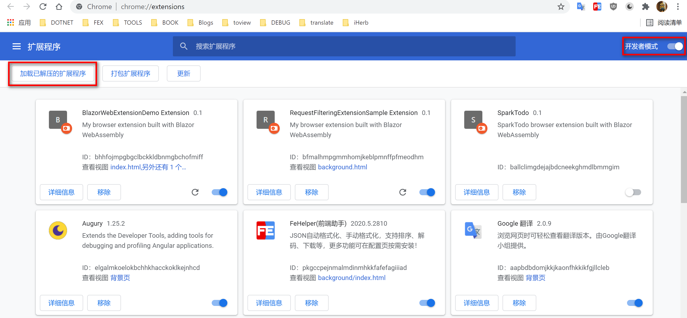
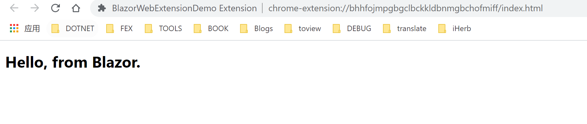
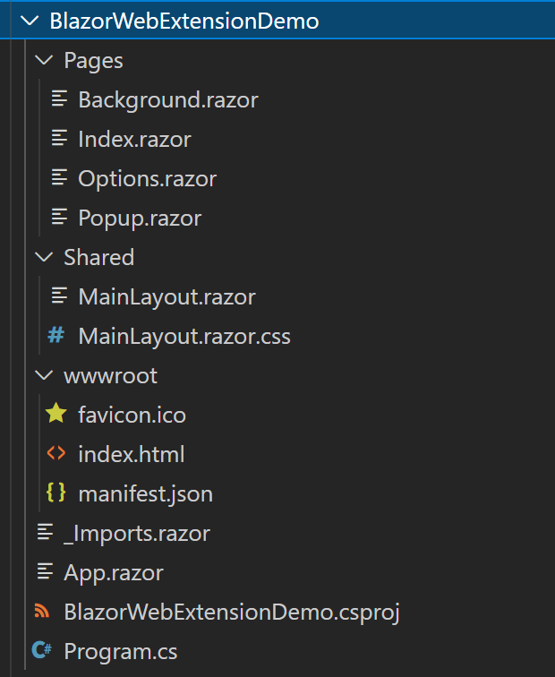
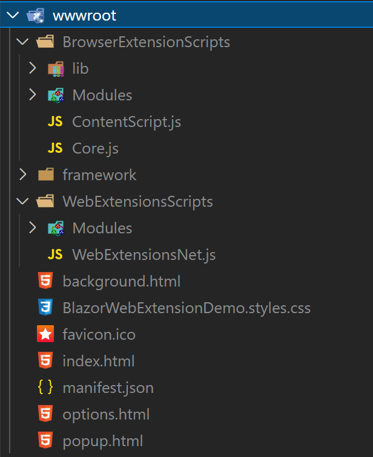
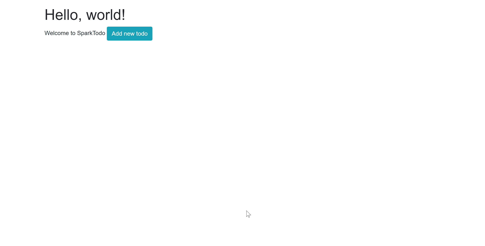

# 使用 C# 开发浏览器扩展

## Intro

前段时间听了 Justin 大佬分享的 Blazor 开发浏览器扩展，觉得很不错，C# 可以做更多有趣的事情了，

很多需要在服务器端做的事情可能就可以在客户端里实现了，而且高度可以复用已有的 C# 代码，而且在浏览器里做很多有趣的事情，所以想写一篇文章和大家分享一下，让大家知道 C# 也是可以开发浏览器扩展的

## BlazorBrowserExtension

`Blazor.BrowserExtension` 是一个使用 Blazor 来开发浏览器扩展的开源项目，项目地址是: https://github.com/mingyaulee/Blazor.BrowserExtension，其工作方式是 Blazor WebAssembly 模式来代替 JavaScript 来工作，这个项目依托于作者的另外一个项目 <https://github.com/mingyaulee/WebExtensions.Net>，`WebExtensions.Net` 这个项目主要是提供了浏览器扩展和浏览器进行交互的 C# API，而 `Blazor.BrowserExtension` 项目则是在其基础之上将浏览器扩展的开发模式和 Blazor 相结合，并且借助于 MS Build 自动化地生成浏览器扩展所必需的资源文件，进一步简化了 C# 开发浏览器扩展的上手难度

## Get Started

如果想要开始一个创建一个浏览器扩展，可以基于项目模板来创建，首先需要安装一下项目模板

``` sh
dotnet new --install Blazor.BrowserExtension.Template
```

然后就可以创建项目了，可以使用下面的命令来基于模板创建项目（替换下面的 `<ProjectName>` 为自己想要使用的项目名称）

``` sh
dotnet new browserext --name <ProjectName>
```

我创建了一个示例项目，名字是 `BlazoreWebExtensionDemo`

目前项目模板有一个模板参数，可以通过 `-F` 来指定项目的 `TargetFramework`，默认是 `net5.0`，可以指定为 `net6.0` 来创建 .NET 6 的项目

之后我们切换到项目目录下，使用 `dotnet build` 来构建项目，build 成功之后就可以在项目的 bin 目录下看到一个 `wwwroot` 目录了，这个目录就包含了浏览器插件所需的所有文件，此时我们的浏览器插件已经完成了。

接着我们来使用一下我们的浏览器扩展，我们需要在浏览器扩展程序页面(chrome 可以直接访问`chrome://extensions/`)启用开发者模式才能直接加载本地的浏览器插件，然后点击 “加载已解压的扩展程序”，然后选择我们上面的 `wwwroot` 目录就可以加载我们的插件了



`BlazoreWebExtensionDemo` 就是我们前面创建的浏览器插件项目，加载好之后，默认项目的行为是会打开一个 Tab ,如下图所示：



我们也可以通过 VS 来创建项目，可以参考作者提供一个 Gif 演示：


## Structure

项目结构如下：



可以看到这就是一个 Blazor 项目的项目结构，和普通的 Blazor 项目并没有太大的差别

项目模板会自动生成几个 Page，可以根据自己需要进行修改

- background(后台页面，通常是后台逻辑)
- index(默认入口)
- options（插件上右键时的“选项”对应的页面）
- popup（插件单击时显示的 Popup 内容）

然后就是 `wwwroot` 目录下的 `manifest.json` 文件，这个文件定义了插件的名称、介绍以及插件所需要的权限以及页面配置等信息，关于 `manifest.json` 的详细信息可以参考文档：<https://developer.mozilla.org/en-US/docs/Mozilla/Add-ons/WebExtensions/manifest.json>

运行 `dotnet build` 之后的结构下：



- BrowserExtensionScripts: 和浏览器扩展交互的一些 js 
- WebExtensionsScripts：WebExtensions 用来和 js 交互的一些 js
- framework：Blazor 项目依赖，包括依赖的dotnet webassembly 环境和一些程序集

## Further

如果想要做进一步的开发，需要怎么做呢？

如果要在代码里使用浏览器扩展的插件，只需要注入 `IWebExtensionsApi` 即可，这是在自动生成的 `Program.cs` 中 `AddBrowserExtensionService` 方法中注册的，详细可以参考: <https://github.com/mingyaulee/Blazor.BrowserExtension/blob/main/src/Blazor.BrowserExtension/Extensions/ServiceCollectionExtensions.cs#L25>

``` c#
builder.Services.AddBrowserExtensionServices(options =>
{
    options.ProjectNamespace = typeof(Program).Namespace;
});
```

具体的浏览器扩展 API 可以参考 MDN 和 Chrome 浏览器扩展的 API 文档以及 Google 提供的 samples <https://github.com/GoogleChrome/chrome-extensions-samples>

我也尝试做了一个简单的浏览器插件，做了一个简单的 todo 提醒，只用到了一个 notification 的 API，数据的管理是基于 EF Core In Memory 来实现的，和之前的 API 实现了一些简单的代码共享，有需要的可以参考 <https://github.com/WeihanLi/SparkTodo/tree/master/SparkTodo.WebExtension>，功能演示可以参考下图：



## More

可以关注支持一下这个基于 Blazor 的浏览器扩展项目 <https://github.com/mingyaulee/Blazor.BrowserExtension>

如果想要开发一个自己的浏览器插件，很多时候可能只是要熟悉一下浏览器扩展的 API 怎么用，可以参考 Google 提供的一系列 chrome extension 的示例，API 基本上应该都是一样的，而且 C# 的 API 是强类型的，可能会更加友好和方便维护。

Justin 大佬最近在做的浏览器扩展项目地址是 <https://github.com/newbe36524/Amazing-Favorites>，感兴趣的可以关注一下，另外大佬之前的分享示例代码可以参考<https://github.com/newbe36524/Newbe.Demo/tree/master/src/BlogDemos/Newbe.Blazor>。

## References

- <https://github.com/mingyaulee/Blazor.BrowserExtension>
- <https://github.com/newbe36524/Amazing-Favorites>
- <https://github.com/mingyaulee/WebExtensions.Net>
- <https://github.com/WeihanLi/SparkTodo/tree/master/SparkTodo.WebExtension>
- <https://github.com/WeihanLi/SamplesInPractice/tree/master/BlazorSample/BlazorWebExtensionDemo>
- <https://developer.mozilla.org/en-US/docs/Mozilla/Add-ons/WebExtensions/Build_a_cross_browser_extension>
- <https://developer.mozilla.org/en-US/docs/Mozilla/Add-ons/WebExtensions>
- [Chrome Extensions API Reference](https://developer.chrome.com/docs/extensions/reference/)
- <https://github.com/GoogleChrome/chrome-extensions-samples>

