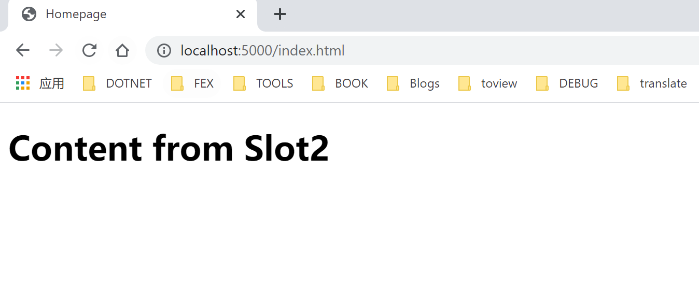

# ASP.NET Core 实现一个简单的动态文件切换

## Intro

前两天我们老板想让我实现一个静态网站“滚动更新”的功能，其实就是希望网站部署的时候网站内容完整的切换，不能网站部署的过程中一部分是新的内容，另外一部分是老的内容。

这让我想到了微软的 Azure App Service，上家公司主要是用微软的云服务 Azure，站点是部署到 Azure App Service 上的，Azure App Service 有一个部署槽的概念，我们的应用一个版本可以对应一个部署槽，通过部署槽我们就基本可以无缝地从一个版本切换到另外一个版本。

## FileProvider

ASP.NET Core 里静态文件的托管是允许自定义一个 `IFileProvider` 的，默认会使用物理路径文件， ASP.NET Core 默认使用 `wwroot` 目录下作为默认的静态文件来源。

对于静态文件而言我们简单地使用两个目录来模拟两个部署槽，当需要的时候通过修改配置来动态修改生效的部署槽，基于 `IOptionMonitor` 和 `PhysicalFileProvider` 来实现一个简单的 `DynamicFileProvider`，实现代码如下：

``` c#
public class DynamicFileProviderOptions
{
    public string CurrentSlot { get; set; }
}

public class DynamicFileProvider : IFileProvider
{
    private PhysicalFileProvider _physicalFileProvider;
    private const string DefaultSlotName = "Slot1";

    public DynamicFileProvider(IOptionsMonitor<DynamicFileProviderOptions> optionsMonitor, IWebHostEnvironment webHostEnvironment)
    {
        var webRoot = webHostEnvironment.ContentRootPath;
        _physicalFileProvider = new PhysicalFileProvider(Path.Combine(webRoot, optionsMonitor.CurrentValue.CurrentSlot ?? DefaultSlotName));
        optionsMonitor.OnChange(options =>
        {
            var path = Path.Combine(webRoot, options.CurrentSlot);
            _physicalFileProvider = new PhysicalFileProvider(path);
        });
    }

    public IDirectoryContents GetDirectoryContents(string subpath)
    {
        return _physicalFileProvider.GetDirectoryContents(subpath);
    }

    public IFileInfo GetFileInfo(string subpath)
    {
        return _physicalFileProvider.GetFileInfo(subpath);
    }

    public IChangeToken Watch(string filter)
    {
        return _physicalFileProvider.Watch(filter);
    }
}
```

看起来是不是简单，其实就是在 `PhysicalFileProvider` 的基础上封装了一下，配置发生变化的时候构建一个新的 `PhysicalFileProvider`

## Construct Host

接着我们来看一下如何使用，使用代码如下：

``` c#
var builder = Host.CreateDefaultBuilder(args);
builder.ConfigureWebHostDefaults(webHostBuilder =>
{
    webHostBuilder.ConfigureServices((context, services) =>
    {
        services.Configure<DynamicFileProviderOptions>(context.Configuration);
        services.AddSingleton<DynamicFileProvider>();
    });
    webHostBuilder.Configure(app =>
    {
        var dynamicFileProvider = app.ApplicationServices.GetRequiredService<DynamicFileProvider>();
        app.UseStaticFiles(new StaticFileOptions()
        {
            FileProvider = dynamicFileProvider,
        });
    });
});
var host = builder.Build();
host.Run();
```

这里的示例是只需要这些代码我们的应用就可以跑起来了，接着我们就来看一下使用效果吧

## Demo

在项目根目录运行 `dotnet run` 启动项目，然后访问 `http://localhost:5000/index.html`


然后我们再修改配置文件中的配置，把 `CurrentSlot` 配置修改为 `Slot2`，然后再刷新页面，如下图所示：



那么是不是可以不修改文件实现部署槽切换呢，也是可以的，我提供了一个做切换的一个简单的 API

``` c#
app.Map(new PathString("/redeploy"), appBuilder => appBuilder.Run(context =>
{
    if (context.RequestServices.GetRequiredService<IConfiguration>() is ConfigurationRoot configuration)
    {
        var currentSlot = configuration["CurrentSlot"];
        configuration["CurrentSlot"] = "Slot2" != currentSlot ? "Slot2" : "Slot1";
        configuration.Reload();
        return context.Response.WriteAsync("Success");
    }
    return Task.CompletedTask;
}));
```

这个 API 做的事情很简单，再 Slot1 和 Slot2 之间进行切换，如果原来是 Slot2 则切换成 Slot1 否则切换成 Slot2，修改配置之后调用一下 `Reload` 以触发配置更新，删除配置文件中的 `CurrentSlot` 配置，重新运行示例，查看 `http://localhost:5000/index.html`，还是看到的 Slot1 中的内容，然后我们调用一下 `/redeploy` 接口来动态切换一下配置，然后再次刷新页面就会看到 Slot2 中的内容，再调用一下 `redeploy` 之后刷新页面就会变回 Slot1 中的内容


## More

这样一个简单的 `DynamicFileProvider` 的功能就完成了，我们就可以动态的切换静态资源的不同版本了。

如果实际使用的话可以考虑更新一下 `redeploy` 接口，把新的网站内容通过上传文件的形式上传到网站下，然后触发配置的更新，而且可以保留最近几个版本的更新，这样部署历史也有了，也方便进行回滚

可以思考一下，如果我们的站点是集群部署的，需要改造什么？

<div style="display: none">
对于集群部署的场景，可能会有两个问题，一个是文件访问的问题，
我们可以使用一个自定义的文件提供者来访问文件服务器上的文件，如果使用容器部署的场景，那么我们使用同一个 Volume 就可以实现统一的文件访问，
另一个问题是配置的管理和更新，对于集群部署的配置，通常我们需要使用配置中心来统一管理配置，这样就和上面的配置一样了，配置更新时也会触发更新。
</div>

## References

- [https://docs.microsoft.com/en-us/aspnet/core/fundamentals/static-files](https://docs.microsoft.com/en-us/aspnet/core/fundamentals/static-files?WT.mc_id=DT-MVP-5004222)
- [https://docs.microsoft.com/zh-cn/azure/app-service/deploy-best-practices](https://docs.microsoft.com/zh-cn/azure/app-service/deploy-best-practices?WT.mc_id=DT-MVP-5004222)
- <https://github.com/WeihanLi/SamplesInPractice/tree/master/DynamicStaticFileProvider>
