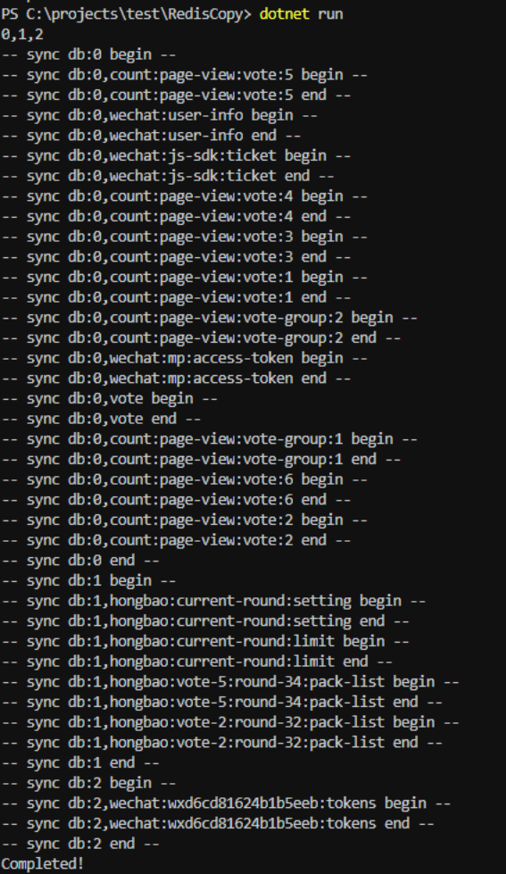

# RedisCopy

## Intro

这个项目是为了实现 redis 的数据迁移而写的一个小工具，将一个实例中的 redis 数据同步到另外一个实例中。

之所以自己写一个工具而不是利用 redis 备份机制来实现，主要是因为我们用的是 redis 云服务，不能像自己的服务器一样 SSH 上去一顿操作，要把云服务的 redis 数据同步到自己服务器上的 redis 实例。

## 基本使用

### 配置解读

``` json
{
  "AppSettings": {
    "SyncDatabases": "0,1",
    "BatchSize": 50
  },
  "ConnectionStrings": {
    "Source": "redis1:6379,asyncTimeout=30000,syncTimeout=30000",
    "Dest": "redis2:6379,password=123433,asyncTimeout=30000,syncTimeout=30000"
  }
}
```

- `AppSettings:SyncDatabases`是要同步的 redis 数据库，多个数据库用英文的逗号分隔
- `AppSettings:BatchSize` 是每次从源 redis 服务器读取 N 个 key（分页读取，每页 N 个）
- `ConnectionStrings:Source` 代表了源 redis 服务器连接字符串
- `ConnectionStrings:Dest` 代表了目标 redis 服务器连接字符串

redis 连接字符串详细参数可以参考文档：<https://weihanli.github.io/StackExchange.Redis-docs-zh-cn/Configuration.html>


### 执行迁移

修改 redis 配置之后（根据自己要同步数据量的大小设置超时时间），在项目根目录下运行 `dotnet run` 即可，


### Sample Run



## More

支持迁移的数据类型：

- String
- Hash
- List
- Set
- ZSet(SortedSet)

## Reference

- <https://github.com/WeihanLi/SamplesInPractice/tree/master/RedisCopy>
- <https://weihanli.github.io/StackExchange.Redis-docs-zh-cn/Configuration.html>

