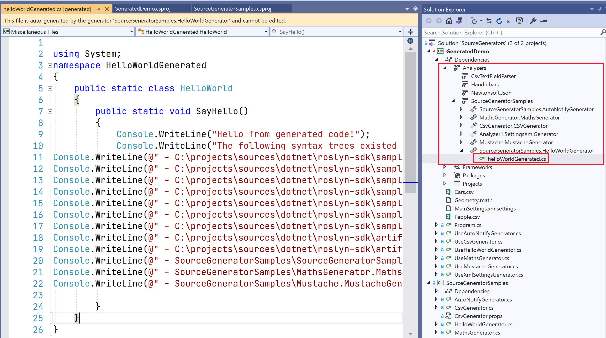
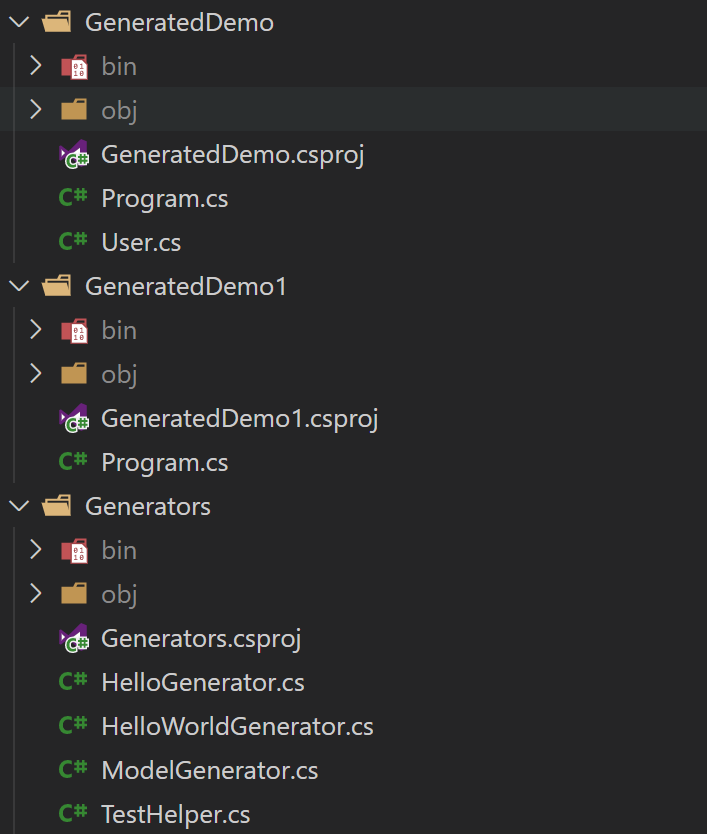
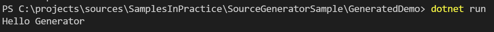
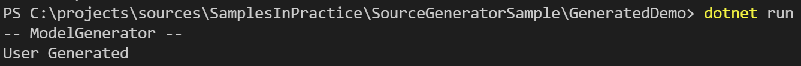
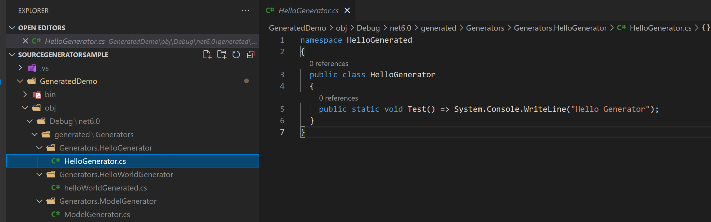

# C# 强大的新特性 Source Generator

## Intro

微软在 .NET 5 中引入了 Source Generator 的新特性，利用 Source Generator 我们可以在应用编译的期间根据当前编译信息动态生成代码，而且可以在我们的 C# 代码中直接引用动态生成的代码，从而大大减少重复代码。

## What

源代码生成器(Source Generators) 是一段在编译过程中运行的代码，可以根据程序中的代码来生成其他文件，这些文件可以与其余代码一起编译。

使用 Source Generators，可以做到这些事情：

- 获取一个 Compilation 对象，这个对象表示了所有正在编译的用户代码，你可以从中获取 AST 和语义模型等信息
- 可以向 Compilation 对象中插入新的代码，让编译器连同已有的用户代码一起编译

Source Generators 作为编译过程中的一个阶段执行：

编译运行 -> [分析源代码 -> 生成新代码] -> 将生成的新代码添加入编译过程 -> 编译继续。

上述流程中，中括号包括的内容即为 Source Generators 所参与的阶段和能做到的事情，如下图所示。


## Why

### 编译时反射

拿 ASP.NET Core 举例，启动一个 ASP.NET Core 应用时，首先会通过运行时反射来发现 Controllers、Services 等的类型定义，然后在请求管道中需要通过运行时反射获取其构造函数信息以便于进行依赖注入。然而运行时反射开销很大，即使缓存了类型签名，对于刚刚启动后的应用也无任何帮助作用，而且不利于做 AOT 编译。

Source Generators 将可以让 ASP.NET Core 所有的类型发现、依赖注入等在编译时就全部完成并编译到最终的程序集当中，最终做到 0 运行时反射使用，不仅利于 AOT 编译，而且运行时 0 开销。

除了上述作用之外，gRPC 等也可以利用此功能在编译时织入代码参与编译，不需要再利用任何的 MSBuild Task 做代码生成啦！

另外，甚至还可以读取 XML、JSON 直接生成 C# 代码参与编译，DTO 编写全自动化都是没问题的。

### AOT 编译

Source Generators 的另一个作用是可以帮助消除 AOT 编译优化的主要障碍。

许多框架和库都大量使用反射，例如 `System.Text.Json`、`System.Text.RegularExpressions`、ASP.NET Core 和 WPF 等等，它们在运行时从用户代码中发现类型。这些非常不利于 AOT 编译优化，因为为了使反射能够正常工作，必须将大量额外甚至可能不需要的类型元数据编译到最终的原生映像当中。

有了 Source Generators 之后，只需要做编译时代码生成便可以避免大部分的运行时反射的使用，让 AOT 编译优化工具能够更好的运行。

## How it works

Source Generator 的工作方式和静态分析器(Analyzer)类似，它是 Analyzer 的补充，在 Analyzer 的基础上增加了生成源代码部分的功能



正常的话可以在项目的 `Dependencies`/`Analyzers` 找到自己的 Source Generator 项目以及动态生成的代码（上图来自 Roslyn 官方的示例(<https://github.com/dotnet/roslyn-sdk/tree/main/samples/CSharp/SourceGenerators>)在 VS 中的截图）

## Sample

来看一个简单的示例吧，示例主要项目结构如下：

`GeneratedDemo` 是引用 Source Generator 的项目，动态生成的代码也是生成在这个项目里

`GeneratedDemo1` 是引用 `GeneratedDemo` 项目的项目，可以不必太关心，只是想验证一下其他项目里是否也可以直接调用生成的代码（毫无疑问是可以的

`Generators` 是我们 Source Generator 的项目，动态生成代码的逻辑都在这个项目里



来看一个 Hello world 示例

首先 `Generators` 项目需要添加对 `Microsoft.CodeAnalysis.CSharp` 的引用，官方示例中还要引用 `Microsoft.CodeAnalysis.Analyzers`，实际测试下来可以不需要引用，因为 `Microsoft.CodeAnalysis.CSharp` 的依赖项 `Microsoft.CodeAnalysis.Common` 已经有对 `Microsoft.CodeAnalysis.Analyzers` 的依赖，如果要使用最新版的也可以添加对最新版本的 `Microsoft.CodeAnalysis.Analyzers` 的依赖

实现一个简单的 Generator，我们需要实现 `ISourceGenerator` 接口并且添加 `[Generator]` Attribute 标记，下面是一个简单的示例：

``` c#
[Generator]
public class HelloGenerator : ISourceGenerator
{
    public void Initialize(GeneratorInitializationContext context)
    {
        // for debugging
        // if (!Debugger.IsAttached) Debugger.Launch();
    }

    public void Execute(GeneratorExecutionContext context)
    {
        var code = @"namespace HelloGenerated
{
  public class HelloGenerator
  {
    public static void Test() => System.Console.WriteLine(""Hello Generator"");
  }
}";
        context.AddSource(nameof(HelloGenerator), code);
    }
}
```

`ISourceGenerator` 有两个接口：

- `Initialize`，在 `Initialize` 方法中， 我们可以通过 `RegisterForSyntaxNotifications` 注册自己的语法接收器来筛选自己关心的语法节点，也可以通过 `RegisterForPostInitialization` 注册初始化完成之后的回调，也可以通过 `CancellationToken` 来判断是否停止初始化过程，如果初始化逻辑比较复杂耗时较长的时候可以考虑判断 `CancellationToken` 来检测用户用户是否取消了编译
- `Execute`，我们通常生成代码都是在这个方法中处理的，这个方法有更多的信息，我们可以获取到当前的编译信息，我们可以通过 `AddSource` 方法来添加我们自定义代码，可以通过 `SyntaxReceiver`/`SyntaxContextReceiver` 来获取我们在 `Initialize` 方法中注册的自定义语法接收器，同样的我们也可以根据  `CancellationToken` 来判断是否停止编译过程

然后我们需要检查一下项目引用，在引用 `Generators` 项目的时候需要设置一下项目 `OutputItemType="Analyzer"`，项目引用示例如下：

``` xml
<ProjectReference Include="..\Generators\Generators.csproj" 
                      OutputItemType="Analyzer" />
```

上面的示例就是一个简单的生成一个 `HelloGenerator` 类，这个类命名空间是 `HelloGenerated`，有一个 `Test` 的静态方法，然后我们就可以在我们的代码里通过 `HelloGenerated.HelloGenerator.Test();` 引用这个方法了

运行 `GeneratedDemo` 项目，就可以得到下面的输出结果了~



上面这个只是一个很简单的直接添加一段代码的示例，我们也可以根据编译信息进行动态生成，再来看一个示例吧

``` c#
[Generator]
public class ModelGenerator : ISourceGenerator
{
    public void Initialize(GeneratorInitializationContext context)
    {
        // Debugger.Launch();
        context.RegisterForSyntaxNotifications(() => new CustomSyntaxReceiver());
    }

    public void Execute(GeneratorExecutionContext context)
    {
        var codeBuilder = new StringBuilder(@"
using System;
using WeihanLi.Extensions;

namespace Generated
{
public class ModelGenerator
{
public static void Test()
{
    Console.WriteLine(""-- ModelGenerator --"");
");

        if (context.SyntaxReceiver is CustomSyntaxReceiver syntaxReceiver)
        {
            foreach (var model in syntaxReceiver.Models)
            {
                codeBuilder.AppendLine($@"      ""{model.Identifier.ValueText} Generated"".Dump();");
            }
        }

        codeBuilder.AppendLine("    }");
        codeBuilder.AppendLine("  }");
        codeBuilder.AppendLine("}");
        var code = codeBuilder.ToString();
        context.AddSource(nameof(ModelGenerator), code);
    }
}

internal class CustomSyntaxReceiver : ISyntaxReceiver
{
    public List<ClassDeclarationSyntax> Models { get; } = new();

    public void OnVisitSyntaxNode(SyntaxNode syntaxNode)
    {
        if (syntaxNode is ClassDeclarationSyntax classDeclarationSyntax)
        {
            Models.Add(classDeclarationSyntax);
        }
    }
}
```

增加了这个 `ModelGenerator` 之后，我在 `GeneratedDemo` 项目里增加了一个 `User` 类来测试，`User` 类很简单，就是一个很普通的 Model

``` c#
public class User
{
    public int Id { get; set; }

    public string Name { get; set; }
}
```

上面这个 Generator，稍微复杂一些，增加了依赖项，依赖项的处理需要修改项目文件，项目文件修改如下：

``` xml
<PropertyGroup>
  <GetTargetPathDependsOn>$(GetTargetPathDependsOn);GetDependencyTargetPaths</GetTargetPathDependsOn>  
</PropertyGroup>
<ItemGroup>
  <PackageReference Include="WeihanLi.Common" Version="1.0.46" GeneratePathProperty="true" />
</ItemGroup>
<Target Name="GetDependencyTargetPaths">
  <ItemGroup>
    <TargetPathWithTargetPlatformMoniker Include="$(PKGWeihanLi_Common)\lib\netstandard2.0\WeihanLi.Common.dll" IncludeRuntimeDependency="false" />
  </ItemGroup>
</Target>
```

需要增加一个 `Target` 来帮助编译器找到相应的依赖，不知道为什么它自己找不到。。感觉后面应该可以优化一下可以自己解析依赖，希望后面的版本能够解决这个依赖解析的问题，不需要开发者自己配置使用起来就比较方便了

执行 `Generated.ModelGenerator.Test();` 来调用我们动态生成的代码，运行结果如下：



可以看到我们动态生成的代码正常工作了

示例 Github 地址：<https://github.com/WeihanLi/SamplesInPractice/tree/master/SourceGeneratorSample>

## Tips

在实际使用的过程中，还是遇到了很多问题，VS 的支持并不是特别的好，有时候 Source Generator 生成的代码 VS 并不能够很好的感知，可能会出现你用 dotnet cli 编译可以通过但是 VS 编译会报错，会出现找不到生成的代码类似的错误，所以比较推荐使用 dotnet cli 进行编译，使用 VS 进行调试

如果需要调试 Source Generator 可以在 Generator 代码里添加 `Debugger.Launch()` 来请求一个 Debugger，这时我们就可以选择 VS 来调试我们的 Generator 代码了

正常的话可以在 VS 里依赖中的 Analyzer 里看到生成的代码，但是有时候 VS 智障的时候就看不到，为了比较一致的开发调试体验，推荐在引用 Source Generator 的项目文件中添加 `<EmitCompilerGeneratedFiles>true</EmitCompilerGeneratedFiles>` 来在项目的 `obj/Debug/$(TargetFramework)/generated` 目录下生成实际生成的源代码，如下图所示，这样我们就可以比较方便的知道生成的代码是否符合我们的预期，另外也可以通过反编译生成的 dll 来查看生成的代码



在引用 Source Generator 的项目中引用的时候 `ReferenceOutputAssembly="false"` 这个是否要设置要根据自己的项目实际情况来定，如果你的 Source Generator 项目里只有一个 Generator，没有别的类被引用可以设置，如果有则不能有这个配置，否则可能会导致编译失败

## More

VS 的支持感觉还是有点欠缺（也可能只是我的 VS 有问题）希望以后会更好，刚开始折腾了两天 VS，VS 还修复了两次，Resharper 也重装了一下，最后还是通过 dotnet cli 去编译了，感谢冯辉大佬的帮助，否则还要浪费更多的时间了

现在已经有很多基于 Source Generator 的项目了，依赖注入、Mock、Mapper 等等，除了官方的示例，也可以从 Github 上这个项目 <https://github.com/amis92/csharp-source-generators> 了解更多，文末有一些不错的参考资料可以了解学习，Channel 9 上也有一个介绍视频，[传送门](https://channel9.msdn.com/Shows/On-NET/C-Source-Generators)

我尝试用 Source Generator 在我们项目中代替了原来的 T4，从原来的比较手动的方式开发时生成，变成自动的在编译时生成，将会在下一篇文章中详细介绍

## References

- <https://devblogs.microsoft.com/dotnet/introducing-c-source-generators/>
- <https://www.cnblogs.com/hez2010/p/12810993.html>
- <https://www.cnblogs.com/yyfh/p/14545758.html>
- <https://www.cnblogs.com/kewei/p/14322474.html>
- <https://github.com/amis92/csharp-source-generators>
- <https://github.com/dotnet/roslyn-sdk/tree/main/samples/CSharp/SourceGenerators>
- <https://channel9.msdn.com/Shows/On-NET/C-Source-Generators>
- <https://github.com/WeihanLi/SamplesInPractice/tree/master/SourceGeneratorSample>

