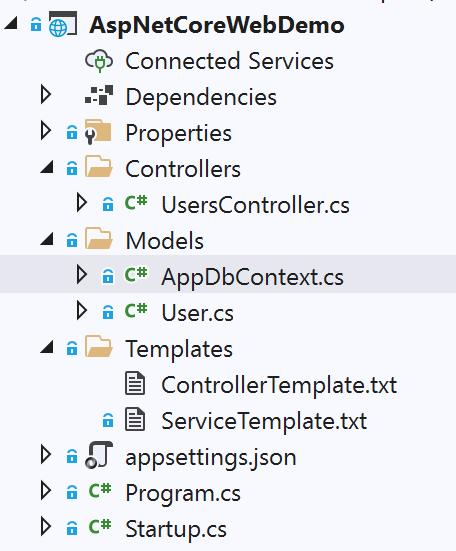
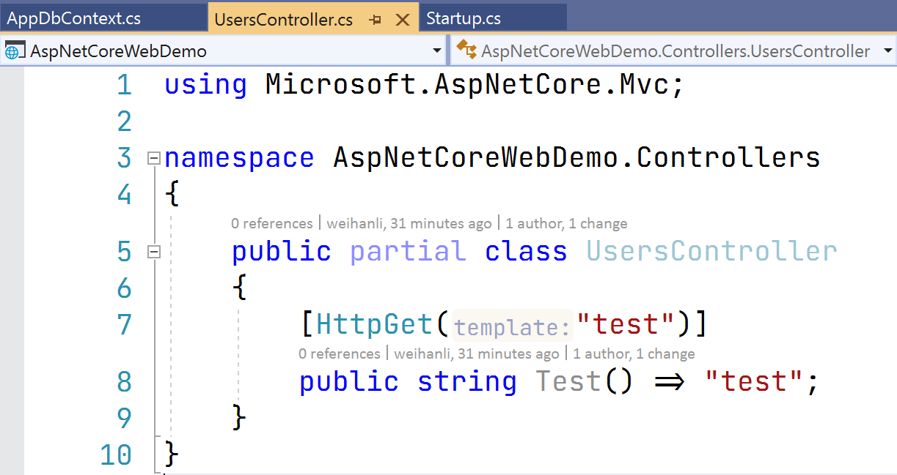

# 使用 Source Generator 自动生成 API

## Intro

上次我们介绍了使用 Source Generator 的应用，有小伙伴留言说想要自动生成一套 ABP 相关的东西，我对 ABP 不怎么熟悉，所以写了一个简单版的雏形，可以根据自定义的模板去动态生成，有需要的可以参考一下

## Generator 示例

``` c#
[Generator]
public class ControllersGenerator : ISourceGenerator
{
    public void Initialize(GeneratorInitializationContext context)
    {
    }

    public void Execute(GeneratorExecutionContext context)
    {
        var appDbContextType = context.Compilation.GetTypeByMetadataName("AspNetCoreWebDemo.Models.AppDbContext");
        // 从编译信息中获取 DbSet<> 类型
        var dbContextType = context.Compilation.GetTypeByMetadataName(typeof(DbSet<>).FullName);
        // 获取 DbContext 中的 DbSet<> 属性
        var propertySymbols = appDbContextType.GetMembers()
            .OfType<IMethodSymbol>()
            .Where(x => x.MethodKind == MethodKind.PropertyGet
                    && x.ReturnType is INamedTypeSymbol
                    {
                        IsGenericType: true,
                        IsUnboundGenericType: false,
                    } typeSymbol
                    && ReferenceEquals(typeSymbol.ConstructedFrom.ContainingAssembly, dbContextType.ContainingAssembly)
                    )
            .ToArray()
            ;
        var propertyReturnType = propertySymbols
            .Select(r =>
                Tuple.Create((INamedTypeSymbol)r.ReturnType, r.Name.Replace("get_", "", StringComparison.OrdinalIgnoreCase))
                )
            .ToArray();
        (string typeName, string propertyName)[] models = propertyReturnType
            .Select(t => (t.Item1.TypeArguments.First().Name, t.Item2))
            .ToArray();

        //Debugger.Launch();

        foreach (var additionalFile in context.AdditionalFiles)
        {
            var templateName = Path.GetFileNameWithoutExtension(additionalFile.Path).Replace("Template", "");
            var template = additionalFile.GetText(context.CancellationToken);

            if (template is not null)
            {
                foreach (var (typeName, propertyName) in models)
                {
                    var code = template.ToString()
                        .Replace("{PropertyName}", propertyName, StringComparison.OrdinalIgnoreCase)
                        .Replace("{TypeName}", typeName, StringComparison.OrdinalIgnoreCase)
                        ;

                    context.AddSource($"{propertyName}{templateName}", code);
                }
            }
        }
    }
}
```

上面的示例通过 `AdditionalFiles` 来获取要生成的代码模板，替换模板内的部分 Placeholder，最终生成期望的代码，而且模板可以是多个模板，也就会生成 N 多份内容

## `Template` 模板

### Service 模板

Service 模板和上一篇文章中生成的代码基本是一样的，只是命令空间不同

上一篇文章中是在代码里写死的代码，而现在我们则是把相同的部分抽出来独立成一个模板，利用模板来动态生成最终的代码，这样的好处在于，我们最终可以在项目里配置而不是直接写死在 `Generator` 代码里，会更加的灵活，修改起来也比较方便

``` 
using AspNetCoreWebDemo.Models;
using WeihanLi.EntityFramework;

namespace AspNetCoreWebDemo.Business
{
    public partial interface I{PropertyName}Service: IEFRepository<AppDbContext, {TypeName}>{}

    public partial class {PropertyName}Service: EFRepository<AppDbContext, {TypeName}>,  I{PropertyName}Service
    {
        public {PropertyName}Service(AppDbContext dbContext) : base(dbContext)
        {
        }
    }
}
```

### Controller 模板

Controller 模板就是我们要来生成 API 的模板，实现了比较简单的增删改查，而且声明的类型是分部类(`partial`) 这样我们就可以比较方便进行扩展，在同一个类增加自定义的逻辑

```
using AspNetCoreWebDemo.Business;
using AspNetCoreWebDemo.Models;
using Microsoft.AspNetCore.Mvc;
using System.Threading.Tasks;
using WeihanLi.Common.Helpers;
using WeihanLi.Common.Models;
using WeihanLi.EntityFramework;

namespace AspNetCoreWebDemo.Controllers
{
    [Route("api/[controller]")]
    public partial class {PropertyName}Controller : ControllerBase
    {
        private readonly I{PropertyName}Service _service;
        public {PropertyName}Controller(I{PropertyName}Service service)
        {
            _service = service;
        }

        [HttpGet]
        public Task<IPagedListResult<{TypeName}>> List([FromQuery] PagedRequest request)
        {
            return _service.PagedAsync(request.PageNum, request.PageSize, ExpressionHelper.True<{TypeName}>(), x => x.Id, false,
                HttpContext.RequestAborted);
        }

        [HttpGet("{id}")]
        public Task<{TypeName}> Details(int id)
        {
            return _service.FetchAsync(x => x.Id == id,
                HttpContext.RequestAborted);
        }

        [HttpPost]
        public async Task<{TypeName}> Create([FromBody] {TypeName} model)
        {
            var result = await _service.InsertAsync(model);
            model.Id = result;
            return model;
        }

        [HttpPut("{id}")]
        public async Task<{TypeName}> Update(int id, [FromBody] {TypeName} model)
        {
            model.Id = id;
            var result = await _service.UpdateWithoutAsync(model, x => x.Id);
            return model;
        }

        [HttpDelete("{id}")]
        public async Task<ActionResult<{TypeName}>> Delete(int id)
        {
            var t = await _service.FetchAsync(x => x.Id == id);
            if (t is null)
            {
                return NotFound();
            }
            await _service.DeleteAsync(x => x.Id == id);
            return t;
        }
    }
}
```

## Project Structure

上面是 Generator 的一些介绍，接着我们来看一个使用这个 Genertor 的项目结构



项目里只有一个 DbContext 和 Models，以及我们要自定义的模板

`UsersController` 这里是为了测试分部类的自定义 controller 补充逻辑，`UserController` 文件的内容如下：



## Generated Files

根据 Controller 模板生成的 controller 文件如下：

``` c#
using AspNetCoreWebDemo.Business;
using AspNetCoreWebDemo.Models;
using Microsoft.AspNetCore.Mvc;
using System.Threading.Tasks;
using WeihanLi.Common.Helpers;
using WeihanLi.Common.Models;
using WeihanLi.EntityFramework;

namespace AspNetCoreWebDemo.Controllers
{
    [Route("api/[controller]")]
    public partial class UsersController : ControllerBase
    {
        private readonly IUsersService _service;
        public UsersController(IUsersService service)
        {
            _service = service;
        }

        [HttpGet]
        public Task<IPagedListResult<User>> List([FromQuery] PagedRequest request)
        {
            return _service.PagedAsync(request.PageNum, request.PageSize, ExpressionHelper.True<User>(), x => x.Id, false,
                HttpContext.RequestAborted);
        }

        [HttpGet("{id}")]
        public Task<User> Details(int id)
        {
            return _service.FetchAsync(x => x.Id == id,
                HttpContext.RequestAborted);
        }

        [HttpPost]
        public async Task<User> Create([FromBody] User model)
        {
            var result = await _service.InsertAsync(model);
            model.Id = result;
            return model;
        }

        [HttpPut("{id}")]
        public async Task<User> Update(int id, [FromBody] User model)
        {
            model.Id = id;
            var result = await _service.UpdateWithoutAsync(model, x => x.Id);
            return model;
        }

        [HttpDelete("{id}")]
        public async Task<ActionResult<User>> Delete(int id)
        {
            var t = await _service.FetchAsync(x => x.Id == id);
            if (t is null)
            {
                return NotFound();
            }
            await _service.DeleteAsync(x => x.Id == id);
            return t;
        }
    }
}
```

## Configure

来看一下 Startup 的配置吧，Startup 中我只配置了 DbContext 和 注册服务配置，详细如下：

``` c#
public class Startup
{
    public Startup(IConfiguration configuration)
    {
        Configuration = configuration;
    }

    public IConfiguration Configuration { get; }

    public void ConfigureServices(IServiceCollection services)
    {
        services.AddDbContext<AppDbContext>(options =>
            options.UseInMemoryDatabase("Test"));
        services.RegisterAssemblyTypesAsImplementedInterfaces(x => x.Name.EndsWith("Service"), ServiceLifetime.Scoped, typeof(Startup).Assembly);
        services.AddControllers();
    }

    public void Configure(IApplicationBuilder app, IWebHostEnvironment env)
    {
        app.UseRouting();

        app.UseEndpoints(endpoints =>
        {
            endpoints.MapControllers();
        });

        // 数据初始化
        using var scope = app.ApplicationServices.CreateScope();
        var dbContext = scope.ServiceProvider.GetRequiredService<AppDbContext>();
        dbContext.Users.Add(new User() { Id = 1, Age = 10, Name = "Xiao Ming", });
        dbContext.SaveChanges();
    }
}
```

## Run

`dotnet run` 运行一下看一下效果吧：


首先访问 `/api/users`，输出结果如下


访问 `/api/users/1`


以上两个 endpoint 都是自动生成的，我们再访问 `/api/users/test` 来测试一下分部类中的接口


可以看到，无论是自动生成的代码还是分部类中自定义的接口都是工作的了

## More

如果想要进行更多的自定义，只需要根据需要调整 Generator 获取生成时所需的类型等信息，再调整相应的模板即可，模板通过 `AdditionalFiles` 来访问，包含进项目中，使用方式如下：

``` xml
<AdditionalFiles Include="Templates/*.txt" />
```

模板可以增加多个，可以根据自己的项目需要进行定制，定义好自己的模板，自动生成一套 ABP 相关的代码我觉得也是可以实现的，感兴趣的可以试试看

## References

- <https://github.com/WeihanLi/SamplesInPractice/tree/master/SourceGeneratorSample/AspNetCoreWebDemo>
- <https://github.com/WeihanLi/SamplesInPractice/blob/master/SourceGeneratorSample/Generators/ControllersGenerator.cs>

