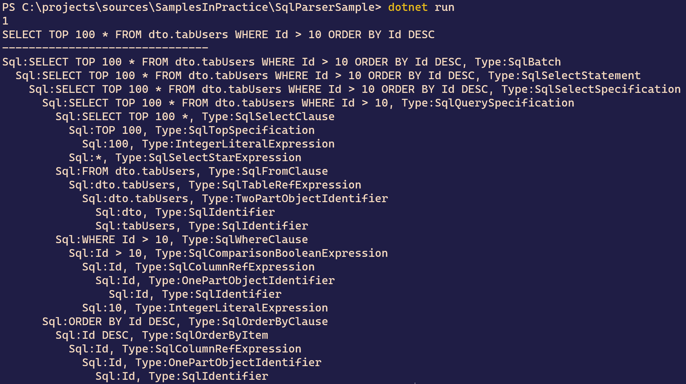

# SqlServer SqlParser 介绍

## Intro

最近发现在 Nuget 上有一个 SqlServer 的 `SqlParser`，利用 `SqlParser` 我们做到可以解析 SQL 的每一部分 ，nuget 包是公开的，可以拿来即用，只是缺少使用示例，很多功能需要自己去摸索

Nuget 包是 <https://www.nuget.org/packages/Microsoft.SqlServer.Management.SqlParser/>

下面我们来看使用示例吧

## Sample

来看一个简单的使用示例：

``` c#
var sqlText = "SELECT TOP 100 * FROM dto.tabUsers WHERE Id > 10 ORDER BY Id DESC";
var result = Parser.Parse(sqlText);
Console.WriteLine(result.BatchCount);
Console.WriteLine(result.Script.Sql);

Console.WriteLine("-------------------------------");
IterateSqlNode(result.Script);
```

上面的 `IterateSqlNode` 方法是一个遍历解析结果的一个方法，定义如下：

``` c#
static void IterateSqlNode(SqlCodeObject sqlCodeObject, int indent=0)
{
    if (sqlCodeObject.Children == null) 
        return;
    foreach (var child in sqlCodeObject.Children)
    {
        Console.WriteLine($"{new string(' ', indent)}Sql:{child.Sql}, Type:{child.GetType().Name}");
        IterateSqlNode(child, indent+2);
    }
}
```

上面示例的输出结果如下：



从上面的输出结果，我们大概可以看得出来一个 `SELECT` 查询的 SQL 组成部分大概有以下部分：

- SqlBatch
  - SqlSelectStatement
    - SqlSelectSpecification
      - SqlQuerySpecification
        - SqlSelectClause
        - SqlFromClause
        - SqlWhereClause
      - SqlOrderByClause

每一个 SQL 语句可能会有多个语句，所以最外层是一个 `SqlBatch`，如果只有一个语句就对应着一个 `SqlBatch`，如果是一个 `SELECT` 查询就是一个 `SqlSelectStatement`，由 `SqlQuery`(`SqlSelectClause`/`SqlFromClause`/`SqlWhereClause`)和 `SqlOrderBy` 组成，还有一些 `GroupByClause`/`HavingClause` 等从句，可以自己去尝试一下

## Practice

接着我们再来看一个实例，我们的带分页的列表查询接口有几个方法内部都是两个方法，一个查询列表，一个查询总数，这样的查询大家是如何处理的呢？

我觉得有些繁琐，合成一个查询就好了，我尝试着利用 `SqlParser` 来分析 SQL 语句，根据列表查询的 SQL 自动生成一个查询总数的 SQL，来看下面这个例子：

``` c#
Console.WriteLine("-------------------------------");
// 查询列表 SQL
sqlText = @"
SELECT u.Id AS UserId, u.[Name] AS UserName, u.City AS [From] FROM dbo.tabUsers AS u WITH(NOLOCK)
INNER JOIN dbo.tabUserRoles AS r WITH(NOLOCK) ON r.UserId= u.Id
WHERE u.Id>10
ORDER BY u.Id DESC
OFFSET 0 ROWS FETCH NEXT 10 ROWS ONLY
";
IterateSqlNode(Parser.Parse(sqlText).Script);

// 根据查询列表的 SQL 生成 GET COUNT 的 SQL
static string GetCountSql(string sql)
{
    var result = Parser.Parse(sql);
    if (result.Script is null)
    {
        throw new ArgumentException("Invalid query", nameof(sql));
    }
    
    var sqlQuery = result.Script.Batches[0].Children.OfType<SqlSelectStatement>().FirstOrDefault()
        ?.Children.OfType<SqlSelectSpecification>().FirstOrDefault()
        ?.Children.OfType<SqlQuerySpecification>().FirstOrDefault();
    if (sqlQuery is null)
    {
        throw new ArgumentException("Invalid query", nameof(sql));
    }

    return $@"SELECT COUNT(1) {sqlQuery.FromClause.Sql} {sqlQuery.WhereClause.Sql}";
}
```

上面这个 SQL 是一个比较典型的我们常用的列表查询 SQL，有的会更简单一些只需要一个表，有些查询条件会比较复杂一些，上面代码输出结果如下（内容有点长）：

```
Sql:
SELECT u.Id AS UserId, u.[Name] AS UserName, u.City AS [From] FROM dbo.tabUsers AS u WITH(NOLOCK)
INNER JOIN dbo.tabUserRoles AS r WITH(NOLOCK) ON r.UserId= u.Id
WHERE u.Id>10
ORDER BY u.Id DESC
OFFSET 0 ROWS FETCH NEXT 10 ROWS ONLY
, Type:SqlBatch
  Sql:SELECT u.Id AS UserId, u.[Name] AS UserName, u.City AS [From] FROM dbo.tabUsers AS u WITH(NOLOCK)
INNER JOIN dbo.tabUserRoles AS r WITH(NOLOCK) ON r.UserId= u.Id
WHERE u.Id>10
ORDER BY u.Id DESC
OFFSET 0 ROWS FETCH NEXT 10 ROWS ONLY, Type:SqlSelectStatement
    Sql:SELECT u.Id AS UserId, u.[Name] AS UserName, u.City AS [From] FROM dbo.tabUsers AS u WITH(NOLOCK)
INNER JOIN dbo.tabUserRoles AS r WITH(NOLOCK) ON r.UserId= u.Id
WHERE u.Id>10
ORDER BY u.Id DESC
OFFSET 0 ROWS FETCH NEXT 10 ROWS ONLY, Type:SqlSelectSpecification
      Sql:SELECT u.Id AS UserId, u.[Name] AS UserName, u.City AS [From] FROM dbo.tabUsers AS u WITH(NOLOCK)
INNER JOIN dbo.tabUserRoles AS r WITH(NOLOCK) ON r.UserId= u.Id
WHERE u.Id>10, Type:SqlQuerySpecification
        Sql:SELECT u.Id AS UserId, u.[Name] AS UserName, u.City AS [From], Type:SqlSelectClause
          Sql:u.Id AS UserId, Type:SqlSelectScalarExpression
            Sql:u.Id, Type:SqlColumnOrPropertyRefExpression
              Sql:u.Id, Type:TwoPartObjectIdentifier
                Sql:u, Type:SqlIdentifier
                Sql:Id, Type:SqlIdentifier
            Sql:UserId, Type:SqlIdentifier
          Sql:u.[Name] AS UserName, Type:SqlSelectScalarExpression
            Sql:u.[Name], Type:SqlColumnOrPropertyRefExpression
              Sql:u.[Name], Type:TwoPartObjectIdentifier
                Sql:u, Type:SqlIdentifier
                Sql:[Name], Type:SqlIdentifier
            Sql:UserName, Type:SqlIdentifier
          Sql:u.City AS [From], Type:SqlSelectScalarExpression
            Sql:u.City, Type:SqlColumnOrPropertyRefExpression
              Sql:u.City, Type:TwoPartObjectIdentifier
                Sql:u, Type:SqlIdentifier
                Sql:City, Type:SqlIdentifier
            Sql:[From], Type:SqlIdentifier
        Sql:FROM dbo.tabUsers AS u WITH(NOLOCK)
INNER JOIN dbo.tabUserRoles AS r WITH(NOLOCK) ON r.UserId= u.Id, Type:SqlFromClause
          Sql:dbo.tabUsers AS u WITH(NOLOCK)
INNER JOIN dbo.tabUserRoles AS r WITH(NOLOCK) ON r.UserId= u.Id, Type:SqlQualifiedJoinTableExpression
            Sql:dbo.tabUsers AS u WITH(NOLOCK), Type:SqlTableRefExpression
              Sql:dbo.tabUsers, Type:TwoPartObjectIdentifier
                Sql:dbo, Type:SqlIdentifier
                Sql:tabUsers, Type:SqlIdentifier
              Sql:u, Type:SqlIdentifier
              Sql:NOLOCK, Type:SqlTableHint
            Sql:dbo.tabUserRoles AS r WITH(NOLOCK), Type:SqlTableRefExpression
              Sql:dbo.tabUserRoles, Type:TwoPartObjectIdentifier
                Sql:dbo, Type:SqlIdentifier
                Sql:tabUserRoles, Type:SqlIdentifier
              Sql:r, Type:SqlIdentifier
              Sql:NOLOCK, Type:SqlTableHint
            Sql:ON r.UserId= u.Id, Type:SqlConditionClause
              Sql:r.UserId= u.Id, Type:SqlComparisonBooleanExpression
                Sql:r.UserId, Type:SqlColumnOrPropertyRefExpression
                  Sql:r.UserId, Type:TwoPartObjectIdentifier
                    Sql:r, Type:SqlIdentifier
                    Sql:UserId, Type:SqlIdentifier
                Sql:u.Id, Type:SqlColumnOrPropertyRefExpression
                  Sql:u.Id, Type:TwoPartObjectIdentifier
                    Sql:u, Type:SqlIdentifier
                    Sql:Id, Type:SqlIdentifier
        Sql:WHERE u.Id>10, Type:SqlWhereClause
          Sql:u.Id>10, Type:SqlComparisonBooleanExpression
            Sql:u.Id, Type:SqlColumnOrPropertyRefExpression
              Sql:u.Id, Type:TwoPartObjectIdentifier
                Sql:u, Type:SqlIdentifier
                Sql:Id, Type:SqlIdentifier
            Sql:10, Type:IntegerLiteralExpression
      Sql:ORDER BY u.Id DESC
OFFSET 0 ROWS FETCH NEXT 10 ROWS ONLY, Type:SqlOrderByClause
        Sql:u.Id DESC, Type:SqlOrderByItem
          Sql:u.Id, Type:SqlColumnOrPropertyRefExpression
            Sql:u.Id, Type:TwoPartObjectIdentifier
              Sql:u, Type:SqlIdentifier
              Sql:Id, Type:SqlIdentifier
        Sql:OFFSET 0 ROWS FETCH NEXT 10 ROWS ONLY, Type:SqlOffsetFetchClause
          Sql:0, Type:IntegerLiteralExpression
          Sql:10, Type:IntegerLiteralExpression
```

输出的查询 COUNT 的 SQL 语句如下：

``` sql
SELECT COUNT(1) FROM dbo.tabUsers AS u WITH(NOLOCK)
INNER JOIN dbo.tabUserRoles AS r WITH(NOLOCK) ON r.UserId= u.Id WHERE u.Id>10
```

看上去还是比较符合预期的，另外测试了几种稍微比较复杂的情况也都是可以满足我们的需要的

可以自动生成了 `COUNT` SQL 之后，我们就可以封装一个方法只需要传一个列表查询的接口就可以了

大概实现如下：

``` c#
public async Task<List<T>> PageListWithTotalAsync<T>(string sql, PageSearchWithTotalDto param)
{
    var countSql = GetCountSql(sql);
    var execSql = $@"
SET @TotalCount=({countSql});
{sql}
OFFSET @Offset ROWS FETCH NEXT @PageSize ROWS ONLY";
    var parameter = new DynamicParameters(param);
    parameter.Output(param, x => x.TotalCount);
    using var conn = new SqlConnection("");
    return (await conn.QueryAsync<T>(execSql, parameter)).ToList();
}
```

`PageSearchWithTotalDto` 是一个 Model，定义如下：

``` c#
public class PageSearchDto
{
    private int _pageNumber = 1;
    private int _pageSize = 20;

    public int PageNumber
    {
        get => _pageNumber;
        set
        {
            if (value > 0)
            {
                _pageNumber = value;
            }
        }
    }

    public virtual int PageSize
    {
        get => _pageSize;
        set
        {
            if (value > 0)
            {
                _pageSize = value;
            }
        }
    }

    public int Offset => (PageNumber - 1) * PageSize;
}

public class PageSearchWithTotalDto : PageSearchDto
{
    public int TotalCount { get; set; }
}
```

调用方式示例如下：

``` c#
var sql = @"SELECT u.Id AS UserId, u.[Name] AS UserName, u.City AS [From] FROM dbo.tabUsers AS u WITH(NOLOCK)
INNER JOIN dbo.tabUserRoles AS r WITH(NOLOCK) ON r.UserId= u.Id
WHERE u.Id>10
ORDER BY u.Id DESC";

var search = new PageSearchWithTotalDto()
{
    PageNum=1,
    PageSize=10,
};
var list = await PageListWithTotalAsync(sql, search);
Console.WriteLine(search.TotalCOunt);
```

相比之前的代码，已经简洁了不少，又有一大波重复代码可以消灭了，舒服~~

## More

使用 `SqlParser` 来自动生成语句这种方案实际上并没有应用到我们的项目中，但是我觉得这个不一样的思路也许对你有所帮助，在你需要解析 SQL 的时候可以考虑一下这个 `SqlParser`。

前面的示例可以从 Github 上获取 <https://github.com/WeihanLi/SamplesInPractice/blob/master/SqlParserSample/Program.cs>，有人在 Github 上提了一个关于开源这个 `SqlParser` 的 issue，有需要可以关注一下 <https://github.com/microsoft/sqltoolsservice/issues/623>

## References

- <https://github.com/WeihanLi/SamplesInPractice/blob/master/SqlParserSample/Program.cs>
- <https://www.nuget.org/packages/Microsoft.SqlServer.Management.SqlParser/>
- <https://github.com/microsoft/sqltoolsservice/issues/623>