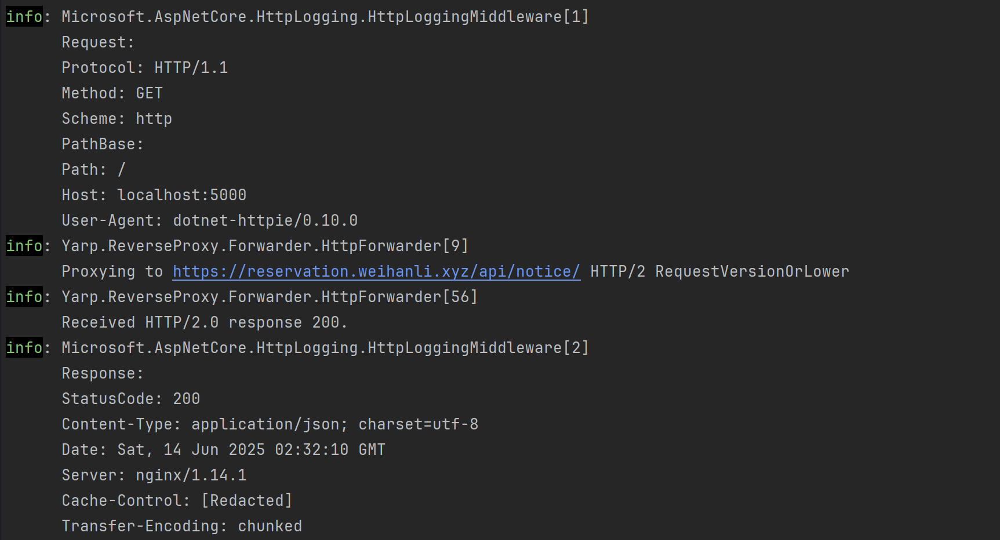

# YARP HTTP 请求诊断

## Intro

最近有在项目里使用 yarp 做一个第三方 API 的反向代理，发现本地是好的，但是发布到测试环境之后就有问题，经过一系列排查发现是 nginx ingress 的问题，在过程中分析 yarp 转发的请求感觉可能会对大家有点帮助，所以分享一下

## Setup

我们先准备一个最简单的 YARP 服务

```c#

var builder = WebApplication.CreateSlimBuilder(args);
builder.Services.AddHttpLogging();
builder.Services.AddSingleton<YarpLoggingTransform>();
builder.Services.AddReverseProxy()
    .LoadFromConfig(builder.Configuration.GetSection("ReverseProxy"))
    ;
var app = builder.Build();
app.MapReverseProxy();
app.Run();

```

示例配置如下：

```c#
{
  "Logging": {
    "LogLevel": {
      "Default": "Information",
      "Microsoft.AspNetCore": "Warning",
      "Microsoft.AspNetCore.HttpLogging": "Information",
      "Yarp": "Debug"
    }
  },
  "ReverseProxy": {
    "Routes": {
      "default" : {
        "ClusterId": "default",
        "Match": {
          "Path": "/"
        }
      }
    },
    "Clusters": {
      "default": {
        "Destinations": {
          "default": {
            "Address": "https://reservation.weihanli.xyz/api/notice"
          }
        }
      }
    }
  }
}
```

我们请求一下 yarp 服务，日志如下：


可以看到日志里只有下游的地址和下游服务返回的 response status code，有些问题需要排查的时候可能信息就不太够用了

## Diagnostics

YARP 请求分成两部分，一部分是直接对 YARP 服务的 http 请求，另一部分是转发到下游的请求

针对 YARP 服务的 http 请求，我们可以使用 ASP.NET Core 自带的 Http Logging 中间件来记录

针对转发到下游的请求，我们可以通过 YARP 的扩展实现 transform 来记录转发的请求信息

## Http Logging

简单的配置如下：

```diff
var builder = WebApplication.CreateSlimBuilder(args);
+ builder.Services.AddHttpLogging();
builder.Services.AddReverseProxy()
    .LoadFromConfig(builder.Configuration.GetSection("ReverseProxy"))
    ;
var app = builder.Build();
+ app.UseHttpLogging();
app.MapReverseProxy();
app.Run();
```

这样我们就可以记录 HTTP 请求的信息了

http logging 日志示例如下：



## Transform

YARP 提供了 Transform 的扩展，我们可以实现一个 transform 来记录转发的完整请求，我们可以使用 `ResponseTransform` 来记录转发的请求和响应，实现示例如下：

为了显式的明确约束，这里继承于 `ResponseTransform` 来实现的，也可以实现一个静态方法即可

```c#
public class YarpLoggingTransform : ResponseTransform
{
    public override ValueTask ApplyAsync(ResponseTransformContext context)
    {
        var proxyResponse = context.ProxyResponse;
        if (proxyResponse is null)
            return ValueTask.CompletedTask;
        
        var proxyRequest = proxyResponse.RequestMessage;

        var logger = context.HttpContext.RequestServices.GetRequiredService<ILogger<YarpLoggingTransform>>();
        if (proxyRequest is not null)
        {
            logger.LogInformation("Proxy request: {Url} {Headers}", 
                proxyRequest.RequestUri?.AbsoluteUri, string.Join(";",
                    proxyRequest.Headers.Select(h => 
                        $"{h.Key}:{string.Join(",", h.Value)}")));
        }
        
        logger.LogInformation("Proxy response: {ResponseStatusCode} {ResponseHeaders}",
            (int)proxyResponse.StatusCode, string.Join(";", proxyResponse.Headers.Select(x=> $"{x.Key}:{string.Join(",", x.Value)}")));
        return ValueTask.CompletedTask;
    }
}
```

这里的 proxyRequest/proxyResponse 就是我们转发到下游服务的 HttpClient 发起的 Http 请求和响应

之后在 YARP 服务注册的地方配置一下使用我们的 Transform

```diff
var builder = WebApplication.CreateSlimBuilder(args);
builder.Services.AddHttpLogging();
+ builder.Services.AddSingleton<YarpLoggingTransform>();
builder.Services.AddReverseProxy()
    .LoadFromConfig(builder.Configuration.GetSection("ReverseProxy"))
+    .AddTransforms(transformContext =>
+        transformContext.ResponseTransforms.Add(transformContext.Services.GetRequiredService<YarpLoggingTransform>()))
    ;
var app = builder.Build();
app.UseHttpLogging();
app.MapReverseProxy();
app.Run();
```

配置之后的日志示例：


这里可以看到我们的转发的请求和响应的 HTTP header 信息都被记录下来了，也可以根据需要进行一些定制

## More

Http Logging Middleware 在前面的示例只是使用了默认的配置，更多使用配置可以参考文档：https://learn.microsoft.com/en-us/aspnet/core/fundamentals/http-logging/?view=aspnetcore-9.0

YARP 也提供了一个 telemetry 的方式，可以基于 telemetry 来实现记录转发到的是哪一个下游服务以及实现一些 tracing/metrics 的需求，但是没有完整的下游转发的请求，没有 header 和 content，有需要可以根据文档自己试一下，所以自己实现了一个 ResponseTransform 来实现 logging 自己想要记录的信息

再说回我们的问题，最后查下来是因为 nginx 默认不支持下划线的 header，从而导致请求头被忽略了，下游服务转发的时候也就没有了对应的 header，从而导致没有返回期望的响应，nginx ingress 有一个配置 `enable-underscores-in-headers`，可以参考：https://kubernetes.github.io/ingress-nginx/user-guide/nginx-configuration/configmap/#enable-underscores-in-headers

但是是一个全局的配置我们自己没权限改，最后基于 YARP 实现了自定义 RequestTransform 在没有期望的 header 的时候自己加了一下来解决

## References

- https://github.com/dotnet/yarp
- https://learn.microsoft.com/en-us/aspnet/core/fundamentals/servers/yarp/extensibility-transforms?WT.mc_id=DT-MVP-5004222
- https://learn.microsoft.com/en-us/aspnet/core/fundamentals/servers/yarp/diagnosing-yarp-issues?WT.mc_id=DT-MVP-5004222
- https://learn.microsoft.com/en-us/aspnet/core/fundamentals/http-logging/?WT.mc_id=DT-MVP-5004222
- https://github.com/WeihanLi/SamplesInPractice/tree/main/YarpSamples/YarpDiagnosticSample
- https://kubernetes.github.io/ingress-nginx/user-guide/nginx-configuration/configmap/#enable-underscores-in-headers
