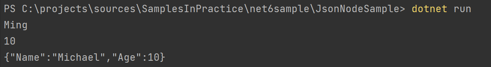
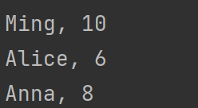
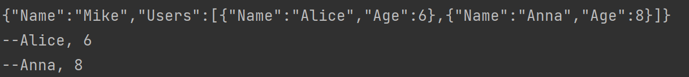
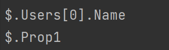
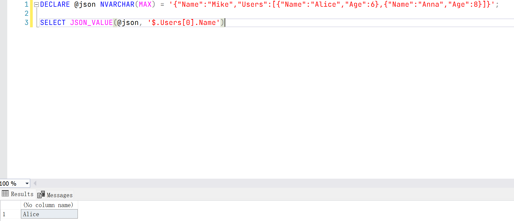

# .NET 6 新特性 System.Text.Json 中的 Writable DOM

## Intro

在 .NET 6 Preview 4 中，微软加入了 JSON Node 的支持，我们可以动态的编辑一个 JSON 文档，一个可以修改的 JSON 文档，就想 `Newtonsoft.Json` 里的 `JToken`，这样我们就可以更加灵活的操作一个 JSON 了。

主要新增的 API 如下：

- `JsonNode`: JSON 文档中的一个节点，对应 `Newtonsoft.Json` 里的 `JToken`
- `JsonObject`: JSON 对象，对应 `Newtonsoft.Json` 里的 `JObject`
- `JsonArray`: JSON 数组，对应 `Newtonsoft.Json` 里的 `JArray`
- `JsonValue`: JSON 中的一个值，对应 `Newtonsoft.Json` 里的 `JValue`

## Sample

你可以使用 `JsonNode.Parse("")` 来将一个 JSON 转换成一个 `JsonNode` 对象，可以看下面的示例：

``` c#
// Parse a JSON object
JsonNode jNode = JsonNode.Parse(@"{""MyProperty"":42}");
int value = (int)jNode["MyProperty"];
Debug.Assert(value == 42);
// or
value = jNode["MyProperty"].GetValue<int>();
Debug.Assert(value == 42);
```

你可以通过 `AsObject` 将 `JsonToken` 转换为 `JsonObject`，通过 `AsArray` 转换为 `JsonArray`，通过 `AsValue` 转换为 `JsonValue`

对于 `JsonNode` 或者 `JsonValue` 可以强制类型转成成期望的类型，如下所示，或者可以通过 `GetValue` 来转成类型，类似于 `Newtonsoft.Json` 里的 `Value<T>()` 扩展方法 

``` c#
// Parse a JSON object
var jNode = JsonNode.Parse(@"{""MyProperty"":42}").AsObject();
var jValue = jNode["MyProperty"].AsValue();
var value = (int)jValue;
Debug.Assert(value == 42);

// or
value = jValue.GetValue<int>();
Debug.Assert(value == 42);
```

再来看一下修改 JSON 文档的一个示例：

``` c#
var testObj = new {Name = "Ming", Age = 10};
var jsonString = JsonSerializer.Serialize(testObj);
var jsonNode = JsonNode.Parse(jsonString);
if (jsonNode is JsonObject jsonObject)
{
    jsonObject["Name"]?.GetValue<string>().Dump();
    jsonObject["Age"]?.GetValue<int>().Dump();

    jsonObject["Name"] = "Michael";
    jsonObject.ToJsonString().Dump();
}
```

`Dump()` 方法是封装的一个扩展方法，会把 value 打印到控制台，输出结果如下：



接着我们来看一个 JSON 数组的示例：

``` c#
var testArrayJsonString = JsonSerializer.Serialize(new[]
{
    new {Name = "Ming", Age = 10}, new {Name = "Alice", Age = 6}, new {Name = "Anna", Age = 8}
});
jsonNode = JsonNode.Parse(testArrayJsonString);
if (jsonNode is JsonArray jsonArray)
{
    jsonArray.Select(item => $"{item["Name"]}, {item["Age"]}")
        .StringJoin(Environment.NewLine)
        .Dump();
}
```

输出结果如下：



接着我们再来看一个组合的示例：

``` c#
var complexObj = new
{
    Name = "Mike", 
    Users = new[]
    {
        new {Name = "Alice", Age = 6}, 
        new {Name = "Anna", Age = 8}
    }
};
var jsonString = JsonSerializer.Serialize(complexObj);
jsonString.Dump();

var jsonNode = JsonNode.Parse(jsonString);
jsonNode?["Users"]?.AsArray().Select(item => $"--{item["Name"]}, {item["Age"]}")
    .StringJoin(Environment.NewLine)
    .Dump();
```

输出结果如下：



另外一点想要提一下，就是现在有一点点 JSON Path 的支持，如果你有用过 SQL Server 里 JSON 查询的话一定对 JSON Path 有一定的了解，JSON Path 就像 XML Path，可以支持我们高效的找到对应的 JSON 节点，但是目前的支持并不好，也许正式如此，微软也并没有进行介绍，`JsonNode` 提供了 `GetPath()` 方法来获取当前 Node 对应的 JSON Path，但是现在对于根据 JSON Path 查询的支持还不行

``` c#
jsonNode["Users"][0]["Name"].GetPath().Dump();
JsonNode.Parse(@"{""Prop1"":1}")["Prop1"].GetPath().Dump();
```

输出结果如下：



我们可以使用 SQL Server 来测试一下 JSON Path 是否正确，测试脚本如下：

``` sql
DECLARE @json NVARCHAR(MAX) = '{"Name":"Mike","Users":[{"Name":"Alice","Age":6},{"Name":"Anna","Age":8}]}';

SELECT JSON_VALUE(@json, '$.Users[0].Name')
```

查询结果如下：



如果可以支持 `jsonNode[jsonPath]` 来直接定位到某一个 Node 就很棒了，期待以后能够支持~~

> 但是目前暂时不会支持，还有一些别的优先级高的 task 并且可能会有一些性能方面的影响，所以很有 .NET 6 不会有这个 feature，可以参考文末的 issue 

## More

JsonNode 相关的 API 在 Preview5 的时候发生了一个 breaking change，命名空间从 `System.Text.Json.Node` 变成了 `System.Text.Json.Nodes`，如果从 Preview4 升级的时候需要注意一下。

## References

- <https://github.com/dotnet/runtime/issues/47649>
- <https://github.com/dotnet/runtime/issues/51937>
- <https://github.com/dotnet/runtime/pull/52200>
- <https://github.com/dotnet/runtime/issues/31068>
