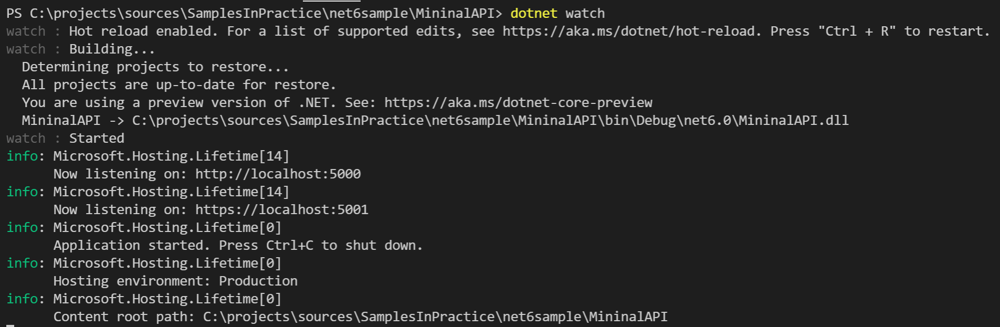
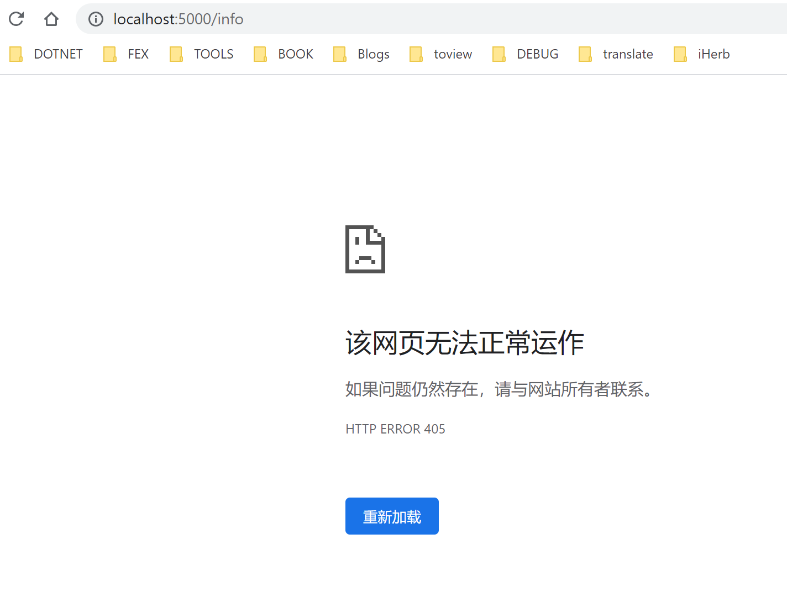
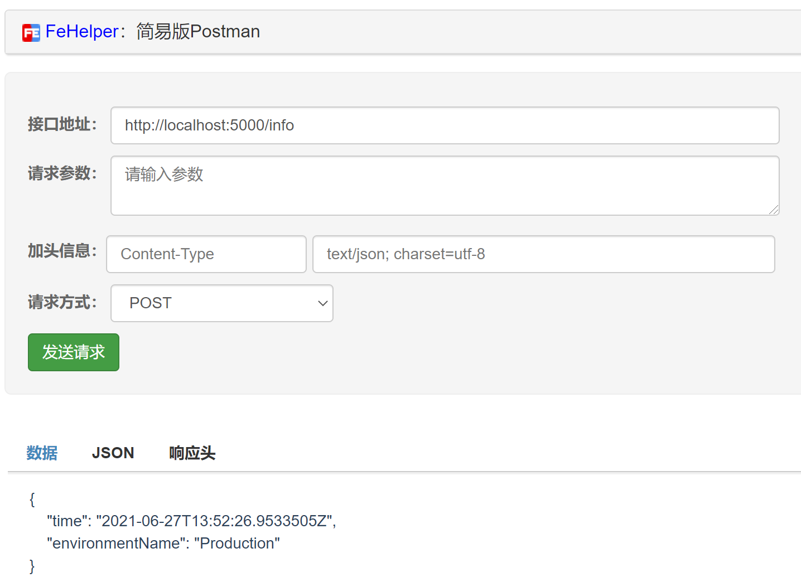

# ASP.NET Core 6 Minimal API

## Intro

微软在 ASP.NET 6 Preview 4 的介绍文章中介绍了即将到来的 ASP.NET Core 6 中的最小 API 的雏形，我们现在已经基本可以达到最小化 API 了雏形了，在 Preview 4 的时候就写了这个小示例，但是不够简洁，没有达到最简洁的代码，现在在 Preview 5 上尝试一下，感觉已经很简洁了，于是就想分享一下

## Sample-0

在 Preview 4 的时候，示例是下面这样的：

``` c#
using System;
using Microsoft.AspNetCore.Builder;

var app = WebApplication.Create(args);
app.Map("/", (Func<string>)(() => "Hello World"));
app.Run();
```

主要是使用了新增的 `WebApplication`/`WebApplicationBuilder` API，然后结合了 C# 9 中的 Top-Level Statement，去掉了 Main 方法的声明

## C# 10 New Features

在即将到来 C# 10 中的两个新特性可以帮助我们简化这个特性，分别是：

- global using
- Enhanced lamdba

通过 global using 这个 feature 我们可以实现命令空间的统一管理这样就可以避免写很多 namespace 的引用了，我们可以把常用的 namespace 放在一个文件中管理，类似于 MVC 中的 `_ViewImports.cshtml` 和 Razor Page 中的 `_Imports`，这样就可以简化上面的 `using` 了，之前看介绍说是，ASP.NET Core 6 会把 ASP.NET Core 相关的常用的命令空间通过 `global using` 的方式默认引用，这样上面的示例中就不需要再引用命名空间了。

另外一个 feature 则是对于 lambda 表达式的优化，可以自动进行类型推断来隐式的转换成委托，就可以简化上面强制类型转换成 `Func<string>` 了，就可以自动的隐式转换了，

除此之外，我们还可以方便的在 lamdba 表达式上加 Attribute 注解，这有助于大大简化 API 书写的复杂度，具体看后面的示例吧

## Sample-1

使用 C# 10 新特性之后的代码：

``` c#
var app = WebApplication.Create(args);
app.Map("/", () => "Hello World");
app.Run();
```

主要有两点变化，一个是 `Func<string>` 的转换不再需要了，一个是命名空间的引用，会放在一个单独 Imports 文件中添加全局的命名空间引用

`Imports` 内容如下：

``` c#
global using System;
global using System.Collections.Generic;
global using System.Linq;
global using System.Threading.Tasks;
global using Microsoft.AspNetCore.Builder;
global using Microsoft.AspNetCore.Http;
global using Microsoft.AspNetCore.Mvc;
global using Microsoft.AspNetCore.Hosting;
global using Microsoft.AspNetCore.Routing;
global using Microsoft.Extensions.DependencyInjection;
global using Microsoft.Extensions.Hosting;
global using Microsoft.Extensions.Logging;
global using Microsoft.Extensions.Configuration;
```

上面提到了我们可以很方便在 lamdba 表达式上使用 Attribute，下面我们就来一个例子：

``` c#
var app = WebApplication.Create(args);
app.MapPost("/info", [HttpPost](IWebHostEnvironment env) => new 
{
    Time = DateTime.UtcNow,
    env.EnvironmentName 
});
app.Run();
```

除了 Attribute，我们还可以添加参数，参数可以自动从依赖注入服务中获取，如上面的 `IWebHostEnvironment`

接着我们来测试一下我们的 API 看试试 work 了吧，现在我们已经可以使用 `dotnet watch` 来运行项目，会自动启用 Hot Reload，但是测试发现，感觉现在的 ASP.NET Core 里的 Hot Reload，还是有点问题，需要使用 Ctrl + R 来重新 build 才能生效，不知道是不是我姿势不对，不知道大家有没有遇到这样的问题，希望后面的版本能够解决这个问题

可以通过 dotnet watch 来启动项目



接着我们就可以通过 `http://localhost:5000` 或者 `https://localhost:5001` 来访问我们的 API 了

访问 `http://localhost:5000`，会看到下面的结果


直接访问 `http://localhost:5000/info`，会看到类似下面的结果，这是因为我们的 `info` API 只允许 POST 方式进行访问



通过工具用 POST 方式访问 `http://localhost:5000/info`，可以看到类似下面的结果



可以看到我们的 API 都已经正常工作了~~

## More

上面的示例代码可以在 Github 上获取 <https://github.com/WeihanLi/SamplesInPractice/tree/master/net6sample/MinimalAPI>

编译需要安装 .NET 6  preview 5 环境

目前 .NET 6 Preview 还是有一些问题的，还不太建议大家实际项目进行升级，当然自己想尝试是可以的

如果使用遇到了什么问题，也可以通过 Github 上的 issue 向微软反馈 <https://github.com/dotnet/core/issues/6389>

## References

- <https://devblogs.microsoft.com/aspnet/asp-net-core-updates-in-net-6-preview-4/>
- <https://github.com/WeihanLi/SamplesInPractice/tree/master/net6sample/MinimalAPI>
