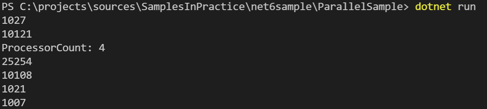

# .NET 6 新特性 Parallel ForEachAsync

## Intro

在 .NET 6 中有一个 API `Parallel.ForEachAsync` 在官方的博客中一直被忽略，但是我觉得这个 API 非常的实用，类似于同步版本的 `Parallel.ForEach`，可以比较高效地控制多个异步任务的并行度。之前的版本中我们会实用信号量来控制异步任务的并发度，使用这个 API 之后就可以大大简化我们的代码，详细可以看下面的示例代码。

## 为什么需要这个 API

## API definition

在使用同步任务并行执行的时候， 我们可以使用 `Parallel.ForEach` 来比较方便的控制多个任务的并行度，以便更好的利用系统资源，比如任务中如果有对受限的系统资源进行访问的时候，此时最好就能够控制并行度， 避免系统资源争用，效率反而不高。

`Parallel.ForEachAsync` 相关的 API 定义如下：

``` c#
public static System.Threading.Tasks.Task ForEachAsync<TSource>(System.Collections.Generic.IEnumerable<TSource> source, System.Func<TSource, CancellationToken, ValueTask> body);

public static System.Threading.Tasks.Task ForEachAsync<TSource>(System.Collections.Generic.IEnumerable<TSource> source, CancellationToken cancellationToken, System.Func<TSource, CancellationToken, ValueTask> body);

public static System.Threading.Tasks.Task ForEachAsync<TSource>(System.Collections.Generic.IEnumerable<TSource> source, System.Threading.Tasks.ParallelOptions parallelOptions, System.Func<TSource, CancellationToken, ValueTask> body);

public static System.Threading.Tasks.Task ForEachAsync<TSource>(System.Collections.Generic.IAsyncEnumerable<TSource> source, System.Func<TSource, CancellationToken, ValueTask> body);

public static System.Threading.Tasks.Task ForEachAsync<TSource>(System.Collections.Generic.IAsyncEnumerable<TSource> source, CancellationToken cancellationToken, System.Func<TSource, CancellationToken, ValueTask> body);

public static System.Threading.Tasks.Task ForEachAsync<TSource>(System.Collections.Generic.IAsyncEnumerable<TSource> source, System.Threading.Tasks.ParallelOptions parallelOptions, System.Func<TSource, CancellationToken, ValueTask> body);
```

通过 `ParallelOptions` 我们可以限制最大并行度以及自定义 `TaskScheduler` 和取消令牌 Token

``` c#
public class ParallelOptions
{

    private TaskScheduler _scheduler;
    private int _maxDegreeOfParallelism;
    private CancellationToken _cancellationToken;

    public ParallelOptions()
    {
        this._scheduler = TaskScheduler.Default;
        this._maxDegreeOfParallelism = -1;
        this._cancellationToken = CancellationToken.None;
    }


    public TaskScheduler? TaskScheduler
    {
        get => this._scheduler;
        set => this._scheduler = value;
    }

    public int MaxDegreeOfParallelism
    {
        get => this._maxDegreeOfParallelism;
        set => this._maxDegreeOfParallelism = value != 0 && value >= -1 ? value : throw new ArgumentOutOfRangeException(nameof (MaxDegreeOfParallelism));
    }

    public CancellationToken CancellationToken
    {
        get => this._cancellationToken;
        set => this._cancellationToken = value;
    }
}
```

## Sample

来看一个实际的示例吧，多个任务并行执行，通常我们会使用 `Task.WhenAll` 来并行多个 Task 的执行，但是 `Task.WhenAll` 不能限制并发度，通常我们是会在异步 task 上封装一层，使用信号量来限制并发，示例如下：

``` c#
using var semaphore = new SemaphoreSlim(10, 10);
await Task.WhenAll(Enumerable.Range(1, 100).Select(async _ =>
{
    try
    {
        await semaphore.WaitAsync();
        await Task.Delay(1000);
    }
    finally
    {
        semaphore.Release();
    }
}));
```

使用 `Parallel.ForEachAsync` 之后，我们就可以大大简化我们的代码：

``` c#
await Parallel.ForEachAsync(Enumerable.Range(1, 100), new ParallelOptions()
{
    MaxDegreeOfParallelism = 10
}, async (_, _) => await Task.Delay(1000));
```

这样是不是简单了很多。

再来看一个所有情况的对比，来看一下是不是符合我们的预期：

``` c#
using System;
using System.Diagnostics;
using System.Linq;
using System.Threading;
using System.Threading.Tasks;
using static System.Console;

var watch = Stopwatch.StartNew();
await Task.WhenAll(Enumerable.Range(1, 100).Select(_ => Task.Delay(1000)));
watch.Stop();
WriteLine(watch.ElapsedMilliseconds);

watch.Restart();
using var semaphore = new SemaphoreSlim(10, 10);
await Task.WhenAll(Enumerable.Range(1, 100).Select(async _ =>
{
    try
    {
        await semaphore.WaitAsync();
        await Task.Delay(1000);
    }
    finally
    {
        semaphore.Release();
    }
}));
watch.Stop();
WriteLine(watch.ElapsedMilliseconds);

WriteLine($"{nameof(Environment.ProcessorCount)}: {Environment.ProcessorCount}");

watch.Restart();
await Parallel.ForEachAsync(Enumerable.Range(1, 100), async (_, _) => await Task.Delay(1000));
watch.Stop();
WriteLine(watch.ElapsedMilliseconds);

watch.Restart();
await Parallel.ForEachAsync(Enumerable.Range(1, 100), new ParallelOptions()
{
    MaxDegreeOfParallelism = 10
}, async (_, _) => await Task.Delay(1000));
watch.Stop();
WriteLine(watch.ElapsedMilliseconds);

watch.Restart();
await Parallel.ForEachAsync(Enumerable.Range(1, 100), new ParallelOptions()
{
    MaxDegreeOfParallelism = 100
}, async (_, _) => await Task.Delay(1000));
watch.Stop();
WriteLine(watch.ElapsedMilliseconds);

watch.Restart();
await Parallel.ForEachAsync(Enumerable.Range(1, 100), new ParallelOptions()
{
    MaxDegreeOfParallelism = int.MaxValue
}, async (_, _) => await Task.Delay(1000));
watch.Stop();
WriteLine(watch.ElapsedMilliseconds);
```

可以先想一下，每种方式执行需要的耗时大概是多久，之后再尝试运行一下看一下结果



## More

执行结果是不是符合你的预期呢？

默认情况下，`Parallel.ForEachAsync` 的最大并行度是当前机器的 CPU 数量，也就是 `Environment.ProcessorCount`，如果要不限制可以指定最大并行度为 `int.MaxValue`

## References

- <https://github.com/WeihanLi/SamplesInPractice/tree/master/net6sample/ParallelSample>
- <https://github.com/dotnet/runtime/pull/46943>
- <https://github.com/dotnet/runtime/blob/911640b3a891f92ff66e9c82ce65f71d203f11a2/src/libraries/System.Threading.Tasks.Parallel/ref/System.Threading.Tasks.Parallel.cs#L39-L44>

