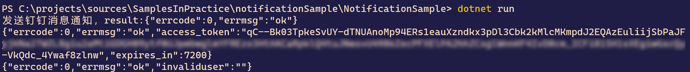

# 搭建简单的通知服务

## Intro

很多情况下，我们都会遇到一些需要进行通知报警的场景，比如说服务器资源监控报警，抢到火车票后通知用户进行付款。

原来主要是用的钉钉群里的机器人来做的通知，周末看到原来做 【Server 酱】的大佬写了一个简单的基于企业微信的微信推送，代码是 PHP 的非常简单，可以参考：<https://github.com/easychen/wecomchan>

于是就自己尝试了一下写了一个 C# 版的，这样就可以直接推送到微信上，对于不怎么用钉钉的小伙伴来说更为方便了。

有的时候我会帮朋友做一些小东西也会需要做通知，比如上次给朋友监控的自如上的一个房子，有一个房子待解冻，朋友想要租这个房子，想要在解冻的第一时间去签约这个房子，于是就写了一个简单的定时去刷房子状态的一个小程序，当房子状态变化的时候就发一个通知给我朋友，这样就可以即时租到自己心仪的房子了。

觉得通知功能还是挺实用的所以结合之前一直在用的钉钉推送和刚学到的微信推送，写了一个小示例来分享一下我用来通知推送的代码，详细参考后面的内容

## 钉钉推送

有用过钉钉的小伙伴可能都知道，钉钉群可以添加机器人，通过调用机器人的 Web Hook 来发送通知。

## 步骤一：获取自定义机器人Webhook

1. 打开机器人管理页面。以PC端为例，打开PC端钉钉，点击头像，选择**机器人管理**。

2. 在机器人管理页面选择**自定义**机器人，输入机器人名字并选择要发送消息的群，同时可以为机器人设置机器人头像。

3. 完成必要的安全设置，勾选**我已阅读并同意《自定义机器人服务及免责条款**》，然后单击**完成**。

   目前有3种安全设置方式，请根据需要选择一种：

   - **自定义关键词**：最多可以设置10个关键词，消息中至少包含其中1个关键词才可以发送成功。

     例如添加了一个自定义关键词：**监控报警**，则这个机器人所发送的消息，必须包含**监控报警**这个词，才能发送成功。

   - **加签**：

     1. 把`timestamp+"\n"+`密钥当做签名字符串，使用HmacSHA256算法计算签名，然后进行Base64 encode，最后再把签名参数再进行urlEncode，得到最终的签名（需要使用UTF-8字符集）。

        | 参数          | 说明                                                         |
        | ------------- | ------------------------------------------------------------ |
        | **timestamp** | 当前时间戳，单位是毫秒，与请求调用时间误差不能超过1小时。    |
        | **secret**    | 密钥，机器人安全设置页面，加签一栏下面显示的SEC开头的字符串。 |

     2. 把 timestamp和第一步得到的签名值拼接到URL中。

        ```
        https://oapi.dingtalk.com/robot/send?access_token=XXXXXX&timestamp=XXX&sign=XXX
        ```

        | 参数      | 说明                   |
        | --------- | ---------------------- |
        | timestamp | 第一步使用到的时间戳。 |
        | sign      | 第一步得到的签名值。   |

   - **IP地址（段）**：设定后，只有来自IP地址范围内的请求才会被正常处理。支持两种设置方式：IP地址和IP地址段，暂不支持IPv6地址白名单，格式如下。

     | 格式       | 说明                                   |
     | ---------- | -------------------------------------- |
     | 1.1.1.1    | 开发者的出口公网IP地址（非局域网地址） |
     | 1.1.1.0/24 | 用CIDR表示的一个网段                   |

4. 完成安全设置后，复制出机器人的 Webhook 地址，可用于向这个群发送消息，格式如下：

   ```javascript
   https://oapi.dingtalk.com/robot/send?access_token=XXXXXX 
   ```

   > 请保管好此Webhook 地址，不要公布在外部网站上，泄露后有安全风险

通常建议使用关键词就可以了（之前的版本其实可以都不设置，后来的版本添加了限制，上面的几种方式需要选一种，推荐使用关键词方式，简单暴力）

钉钉机器人推送代码：

``` c#
// 钉钉机器人推送用的 WebHook 地址
private const string DingBotWebHookUrl =
    "https://oapi.dingtalk.com/robot/send?access_token=";

public static async Task MainTest()
{
    using var httpClient = new HttpClient();
    using var response = await httpClient.PostAsync(DingBotWebHookUrl,
        new StringContent(
            new {msgtype = "text", text = new {content = $"Test... {DateTime.Now:yyyy-MM-dd HH:mm:ss}"}}
                .ToJson(), Encoding.UTF8, "application/json"));
    var result = await response.Content.ReadAsStringAsync();
    Console.WriteLine($"发送钉钉消息通知，result:{result}");
}
```

## 企业微信推送

这个是根据大佬的这个项目改的 <https://github.com/easychen/wecomchan>，原来项目的代码是 PHP 的，我改成了 C# 的，有需要的可以参考一下，现在的代码里比较简单没有对 access_token 做缓存，实际使用的时候建议进行缓存，token 快过期的时候再去申请新的 token。

使用企业微信推送需要先注册一个企业微信号，不需要进行认证，用微信注册就好了，注册步骤引用大佬的介绍

#### 第一步，注册企业

用电脑打开[企业微信官网](https://work.weixin.qq.com/)，注册一个企业

#### 第二步，创建应用

注册成功后，点「管理企业」进入管理界面，选择「应用管理」 → 「自建」 → 「创建应用」

[](https://camo.githubusercontent.com/c85602d131ba9fc1febf43aa851933ddaf0e7a36a7d334e2c51b497798550eea/68747470733a2f2f746865736576656e2e667471712e636f6d2f32303231303230383134333232382e706e67)

应用名称填入「Server酱」，应用logo可以到[这里](https://theseven.ftqq.com/20210208142819.png)下载，可见范围选择公司名。

[](https://camo.githubusercontent.com/f590bd0f72c741936fcf081ed5ad6ad6e62fe64b003b090693457a46078c4a2a/68747470733a2f2f746865736576656e2e667471712e636f6d2f32303231303230383134333332372e706e67)

创建完成后进入应用详情页，可以得到应用ID( `agentid` )①，应用Secret( `secret` )②。

注意：`secret`推送到手机端时，只能在`企业微信客户端`中查看。

[](https://camo.githubusercontent.com/ec3ddd2dd460680f9fc61acc8a1bd215fcb947608102764539c4ce43bc1e0f26/68747470733a2f2f746865736576656e2e667471712e636f6d2f32303231303230383134333535332e706e67)

#### 第三步，获取企业ID

进入「[我的企业](https://work.weixin.qq.com/wework_admin/frame#profile)」页面，拉到最下边，可以看到企业ID③，复制并填到上方。

推送UID直接填 `@all` ，推送给公司全员。

#### 第四步，推送消息到微信

进入「我的企业」 → 「[微信插件](https://work.weixin.qq.com/wework_admin/frame#profile/wxPlugin)」，拉到下边扫描二维码，关注以后即可收到推送的消息。

[](https://camo.githubusercontent.com/cada0b7dcec30ab707403c0cf22380a25442eddb44a4e173230cfab3e8e9b1b8/68747470733a2f2f746865736576656e2e667471712e636f6d2f32303231303230383134343830382e706e67)

> 上面的应用 id 和 logo 可以自定义，不必和上面保持一致

钉钉的推送较为简单，直接调用一次接口就可以了，微信的稍微麻烦一些，需要先获取一下 access_token，然后再调用发消息的接口

推送示例代码如下：

``` c#
// 企业 id
private const string CorpId = "ww3508de6cad12eebd";
// 应用 id
private const string AppId = "1000003";
// 应用 secret
private const string AppSecret = "";
// 要推送的用户，"@all" 表示全员推送
private const string ToUid = "@all";

public static async Task MainTest()
{
    var getTokenUrl =
        $"https://qyapi.weixin.qq.com/cgi-bin/gettoken?corpid={CorpId.UrlEncode()}&corpsecret={AppSecret.UrlEncode()}";

    using var httpClient = new HttpClient();
    var responseStr = await httpClient.GetStringAsync(getTokenUrl);
    Console.WriteLine(responseStr);
    var accessToken = JsonNode.Parse(responseStr)["access_token"].GetValue<string>();

    var sendMessageUrl =
        $"https://qyapi.weixin.qq.com/cgi-bin/message/send?access_token={accessToken.UrlEncode()}";

    using var response = await httpClient.PostAsJsonAsync(sendMessageUrl,
        new
        {
            touser = ToUid,
            msgtype = "text",
            agentid = AppId,
            text = new {content = $"Test {DateTime.Now:yyyy-MM-dd HH:mm:ss}"}
        });
    responseStr = await response.Content.ReadAsStringAsync();
    Console.WriteLine(responseStr);
}
```

推送示例输出结果如下：



## More

感觉还是钉钉的推送更简单一些，直接调用一次就好了，access_token 是固定的

使用微信推送的时候最好考虑缓存 access_token ，不能频繁调用gettoken接口，否则会受到频率拦截

上面的示例代码可以从 [Github](<https://github.com/WeihanLi/SamplesInPractice/tree/master/notificationSample>) 获取

## References

- <https://github.com/WeihanLi/SamplesInPractice/tree/master/notificationSample>
- <https://developers.dingtalk.com/document/app/custom-robot-access>
- <https://github.com/easychen/wecomchan>
- <https://work.weixin.qq.com/api/doc/90000/90003/90487>
- <https://work.weixin.qq.com/api/doc/90000/90135/90236>

